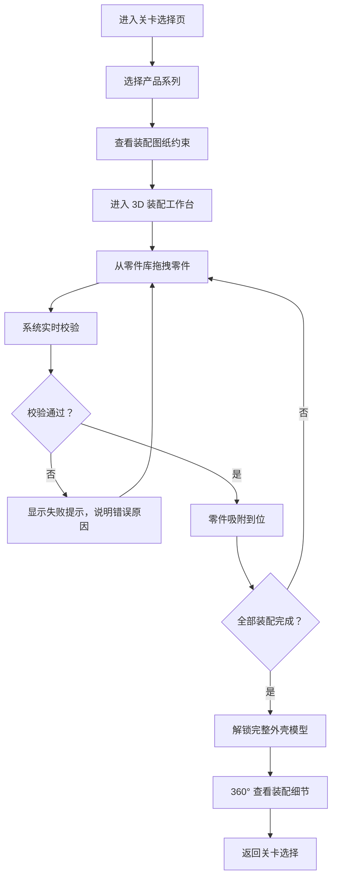

## 1. 产品概述

工业设计样机装配培训系统是一款面向工业设计新人的交互式 3D 装配学习平台。通过拖拽式三维网格画布，用户可以模拟真实样机装配过程，掌握零件装配顺序、卡扣对接规范及内部空间预留等核心技能。

- 核心价值：将抽象的装配规范转化为可视化、可交互的 3D 实训体验
- 目标用户：工业设计专业学生、企业新人设计师
- 产品定位：专业级装配规范培训工具，无任何计价、货架相关功能

## 2. 核心功能

### 2.1 用户角色
| 角色 | 注册方式 | 核心权限 |
|------|----------|----------|
| 学员用户 | 无需注册，直接使用 | 关卡学习、装配操作、成绩查看 |

### 2.2 功能模块
1. **关卡选择页**：产品系列展示、关卡解锁进度、难度标识
2. **3D 装配工作台**：三维网格画布、零件库、装配图纸约束面板、校验提示
3. **装配成功页**：解锁外壳模型展示、360° 旋转查看、装配数据统计

### 2.3 页面详情
| 页面名称 | 模块名称 | 功能描述 |
|----------|----------|----------|
| 关卡选择页 | 产品系列卡片 | 展示不同产品系列（9919、3918），显示解锁状态和难度 |
| 关卡选择页 | 进度概览 | 显示总完成度、已解锁关卡数、最佳成绩 |
| 3D 装配工作台 | 三维网格画布 | 支持拖拽零件、旋转视角、缩放、平移操作 |
| 3D 装配工作台 | 零件库面板 | 分类展示当前关卡可用零件，显示装配顺序提示 |
| 3D 装配工作台 | 装配图纸约束 | 显示当前关卡的装配顺序、卡扣位置、空间距离要求 |
| 3D 装配工作台 | 实时校验系统 | 检测装配顺序错误、零件错位、间隙不足等问题并提示 |
| 装配成功页 | 外壳模型展示 | 展示解锁的完整产品外壳，支持 360° 旋转查看 |
| 装配成功页 | 装配数据统计 | 用时、错误次数、装配精度评分 |

## 3. 核心流程

用户从关卡选择进入，查看装配图纸约束后，在 3D 画布上按顺序拖拽零件进行装配。系统实时校验装配正确性，错误时给出提示，全部正确装配后解锁完整外壳模型。

## 4. 用户界面设计

### 4.1 设计风格
- 主色调：工业蓝 `#1E3A5F` 搭配科技青 `#00D4FF`，营造专业工业设计氛围
- 辅色：警示橙 `#FF6B35` 用于错误提示，成功绿 `#00C9A7` 用于通过反馈
- 背景：深色金属质感背景，搭配细微网格纹理，突出 3D 场景
- 字体：主标题使用 Rajdhani（工业感强的字体），正文使用 Inter
- 按钮风格：立体倒角按钮，悬浮时有微光效果，按下有凹陷反馈
- 整体风格：科技工业风，深色主题，高对比度，强调精准和专业感

### 4.2 页面设计概览
| 页面名称 | 模块名称 | UI 元素 |
|----------|----------|---------|
| 关卡选择页 | 产品系列卡片 | 金属质感卡片、3D 缩略图、解锁锁图标、难度星级 |
| 关卡选择页 | 进度条 | 发光进度条、粒子效果、数字动画 |
| 3D 装配工作台 | 三维画布 | 网格地面、环境光、辅助线、零件高亮轮廓 |
| 3D 装配工作台 | 零件库 | 分类标签、零件缩略图、序号徽章、拖拽状态 |
| 3D 装配工作台 | 约束面板 | 折叠式面板、步骤指示器、对勾/叉号状态 |
| 3D 装配工作台 | 校验提示 | 浮动消息条、震动反馈、红色错误光晕 |
| 装配成功页 | 展示区 | 聚光灯效果、缓慢自转、光晕环绕 |

### 4.3 响应式
- 桌面端优先设计，适配 1280px 及以上宽度
- 平板端自适应布局，零件库可收起
- 不支持移动端（装配操作需要精确拖拽）

### 4.4 3D 场景指引
- 环境：深色工业场景，配 HDRI 环境贴图，反射柔和
- 灯光：三点布光（主光 + 补光 + 轮廓光），突出零件质感和卡扣细节
- 相机：透视相机，初始 45° 俯视角，支持轨道控制旋转、缩放、平移
- 交互：零件拖拽时有半透明预览，吸附时有吸附动画和音效感
- 后处理：轻微泛光效果，边缘抗锯齿，选中零件有发光轮廓
- 性能：每个关卡零件控制在 10-20 个，使用实例化渲染优化
