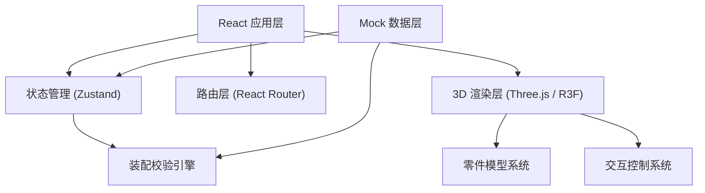

## 1. 架构设计



## 2. 技术描述

- **前端框架**: React@18 + TypeScript + Vite
- **3D 渲染**: three@^0.160.0, @react-three/fiber@^8.15.0, @react-three/drei@^9.88.0
- **状态管理**: zustand@^4.4.0
- **样式方案**: tailwindcss@^3.4.0
- **路由**: react-router-dom@^6.20.0
- **动画**: framer-motion@^10.16.0
- **后端**: 无后端，纯前端 Mock 数据
- **数据持久化**: localStorage 存储关卡进度

## 3. 路由定义

| 路由 | 页面 | 功能 |
|------|------|------|
| `/` | 关卡选择页 | 产品系列展示、进度查看、关卡选择 |
| `/assembly/:levelId` | 3D 装配工作台 | 零件拖拽、实时校验、装配操作 |
| `/success/:levelId` | 装配成功页 | 外壳展示、数据统计、返回选择 |

## 4. 数据模型

### 4.1 核心数据类型

```typescript
// 零件定义
interface Part {
  id: string;
  name: string;
  category: string;
  geometry: {
    type: 'box' | 'cylinder' | 'custom';
    dimensions: [number, number, number];
    color: string;
  };
  targetPosition: [number, number, number];
  targetRotation: [number, number, number];
  snapTolerance: number;
  order: number;
}

// 卡扣约束
interface SnapConstraint {
  id: string;
  partA: string;
  partB: string;
  snapPoints: {
    positionA: [number, number, number];
    positionB: [number, number, number];
  };
  tolerance: number;
}

// 空间距离约束
interface SpaceConstraint {
  id: string;
  partA: string;
  partB: string;
  minDistance: number;
  maxDistance: number;
  axis: 'x' | 'y' | 'z' | 'all';
}

// 关卡定义
interface Level {
  id: string;
  name: string;
  series: '9919' | '3918';
  difficulty: number;
  description: string;
  parts: Part[];
  snapConstraints: SnapConstraint[];
  spaceConstraints: SpaceConstraint[];
  assemblyOrder: string[];
  shellModel: {
    name: string;
    color: string;
    dimensions: [number, number, number];
  };
}

// 装配状态
interface AssemblyState {
  placedParts: Map<string, {
    position: [number, number, number];
    rotation: [number, number, number];
    isCorrect: boolean;
  }>;
  currentStep: number;
  errorCount: number;
  startTime: number;
  isComplete: boolean;
}

// 校验结果
interface ValidationResult {
  passed: boolean;
  errorType?: 'order' | 'position' | 'snap' | 'space';
  message: string;
  hint?: string;
}
```

### 4.2 装配校验引擎

校验引擎是核心逻辑模块，包含以下校验规则：

1. **装配顺序校验**：检查零件是否按照 `assemblyOrder` 定义的顺序装配
2. **位置精度校验**：检查零件位置是否在 `snapTolerance` 容差范围内
3. **卡扣对接校验**：检查关联零件的卡扣点是否正确对接
4. **空间距离校验**：检查零件间距离是否在 `minDistance` 和 `maxDistance` 范围内

## 5. 核心模块

### 5.1 3D 交互模块
- 零件拖拽：基于 Raycaster 的 3D 拾取和拖拽
- 视角控制：OrbitControls 轨道控制器
- 吸附效果：零件靠近目标位置时自动吸附动画
- 高亮反馈：选中零件发光轮廓效果

### 5.2 校验引擎模块
- 实时校验：每次放置零件后自动触发校验
- 错误分级：警告级（位置偏差）和错误级（顺序颠倒）
- 提示系统：针对不同错误类型给出具体改进建议

### 5.3 进度管理模块
- 关卡解锁：完成前一关自动解锁下一关
- 成绩记录：记录最佳用时、最少错误次数
- 本地存储：使用 localStorage 持久化进度数据

## 6. 文件结构

```
src/
├── pages/
│   ├── LevelSelect/      # 关卡选择页
│   ├── Assembly/         # 3D 装配工作台
│   └── Success/          # 装配成功页
├── components/
│   ├── PartLibrary/      # 零件库组件
│   ├── ConstraintPanel/  # 约束面板
│   ├── ValidationToast/  # 校验提示
│   └── ProgressBar/      # 进度条
├── store/
│   ├── useAssemblyStore  # 装配状态管理
│   └── useProgressStore  # 进度状态管理
├── engine/
│   └── validationEngine  # 装配校验引擎
├── data/
│   └── levels/           # 关卡 Mock 数据
├── types/
│   └── index.ts          # 类型定义
└── utils/
    └── threeHelpers      # Three.js 工具函数
```
